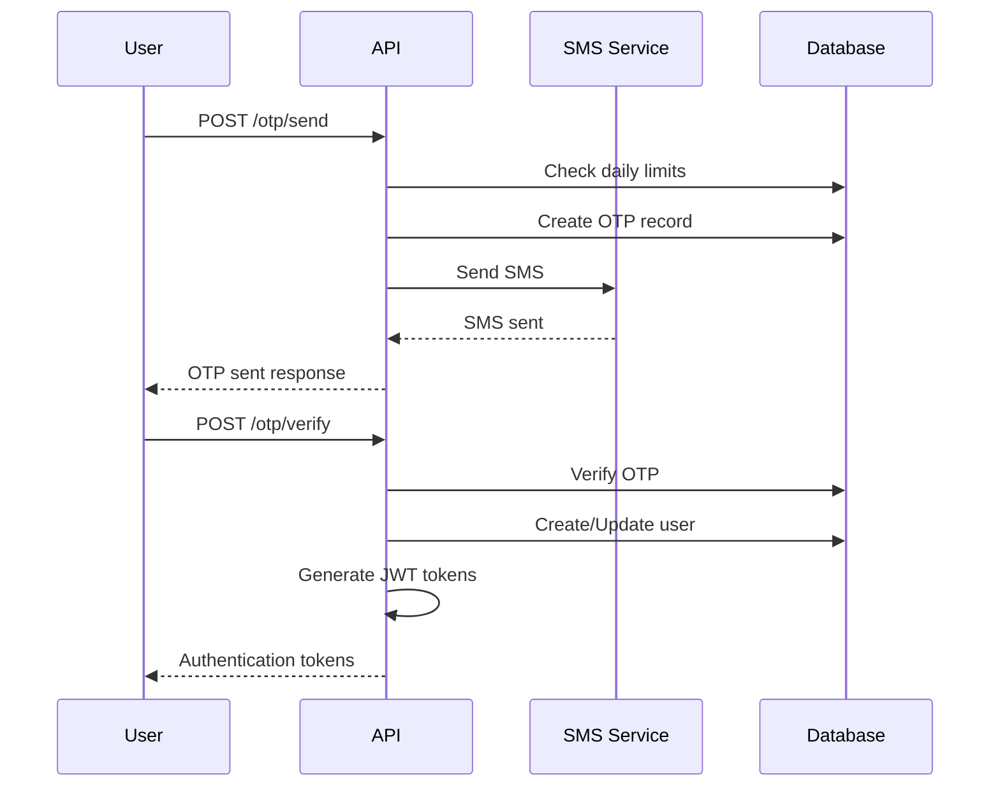
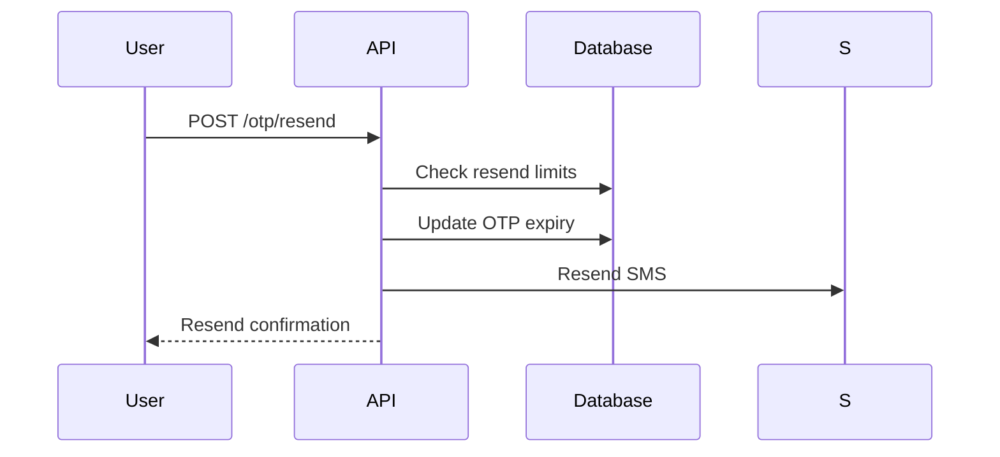

# OTP Verification System

This document describes the custom OTP-based phone verification system implemented in the Farmacy backend.

## Overview

The OTP system provides secure phone number verification with the following features:

- **6-digit OTP generation** with configurable expiry (default: 5 minutes)
- **Resend functionality** with a maximum of 2 resend attempts
- **Daily limits** with configurable maximum OTPs per day (default: 5)
- **IST timezone** for all operations (Indian Standard Time)
- **Optimized database queries** with minimal DB impact
- **Multiple SMS service support** (Twilio, AWS SNS, MSG91, Mock)
- **Automatic user creation** upon successful verification
- **JWT token generation** for authenticated sessions

## Database Schema

### OTPRecord Table
```sql
CREATE TABLE otp_records (
    id SERIAL PRIMARY KEY,
    phone_number VARCHAR(20) NOT NULL,
    otp_code VARCHAR(6) NOT NULL,
    is_verified BOOLEAN DEFAULT FALSE,
    is_expired BOOLEAN DEFAULT FALSE,
    created_at TIMESTAMP WITH TIME ZONE DEFAULT NOW(),
    expires_at TIMESTAMP WITH TIME ZONE NOT NULL,
    verified_at TIMESTAMP WITH TIME ZONE,
    resend_count INTEGER DEFAULT 0,
    max_resend_allowed INTEGER DEFAULT 2,
    ip_address VARCHAR(45),
    user_agent TEXT
);
```

### DailyOTPLimit Table
```sql
CREATE TABLE daily_otp_limits (
    id SERIAL PRIMARY KEY,
    phone_number VARCHAR(20) NOT NULL,
    date TIMESTAMP WITH TIME ZONE NOT NULL,
    otp_count INTEGER DEFAULT 0,
    max_otp_per_day INTEGER DEFAULT 5,
    created_at TIMESTAMP WITH TIME ZONE DEFAULT NOW(),
    updated_at TIMESTAMP WITH TIME ZONE DEFAULT NOW()
);
```

## API Endpoints

### 1. Send OTP
**POST** `/otp/send`

Send a new OTP to the specified phone number.

**Request Body:**
```json
{
    "phone_number": "+919876543210"
}
```

**Response:**
```json
{
    "message": "OTP sent successfully",
    "phone_number": "+919876543210",
    "expires_in_minutes": 5,
    "daily_otp_remaining": 4
}
```

### 2. Verify OTP
**POST** `/otp/verify`

Verify the OTP and authenticate the user.

**Request Body:**
```json
{
    "phone_number": "+919876543210",
    "otp_code": "123456"
}
```

**Response:**
```json
{
    "message": "OTP verified successfully",
    "phone_number": "+919876543210",
    "is_verified": true,
    "user_exists": true,
    "access_token": "eyJ0eXAiOiJKV1QiLCJhbGciOiJIUzI1NiJ9...",
    "refresh_token": "eyJ0eXAiOiJKV1QiLCJhbGciOiJIUzI1NiJ9..."
}
```

### 3. Resend OTP
**POST** `/otp/resend`

Resend OTP to the same phone number (within limits).

**Request Body:**
```json
{
    "phone_number": "+919876543210"
}
```

**Response:**
```json
{
    "message": "OTP resent successfully",
    "phone_number": "+919876543210",
    "expires_in_minutes": 5,
    "resend_attempts_remaining": 1,
    "daily_otp_remaining": 3
}
```

### 4. Get OTP Status
**GET** `/otp/status/{phone_number}`

Get the current OTP status for a phone number.

**Response:**
```json
{
    "phone_number": "+919876543210",
    "has_active_otp": true,
    "expires_at": "2024-01-15T10:30:00Z",
    "resend_attempts_remaining": 2,
    "daily_otp_remaining": 4
}
```

### 5. Expire OTP
**DELETE** `/otp/expire/{phone_number}`

Manually expire all active OTPs for a phone number.

**Response:**
```json
{
    "message": "All OTPs expired successfully"
}
```

## SMS Service Integration

The system supports multiple SMS providers:

### 1. Twilio
Add to your `.env` file:
```env
TWILIO_ACCOUNT_SID=your_account_sid
TWILIO_AUTH_TOKEN=your_auth_token
TWILIO_PHONE_NUMBER=your_twilio_number
```

### 2. AWS SNS
Add to your `.env` file:
```env
AWS_ACCESS_KEY_ID=your_access_key
AWS_SECRET_ACCESS_KEY=your_secret_key
AWS_REGION=us-east-1
```

### 3. MSG91 (Popular in India)
Add to your `.env` file:
```env
MSG91_API_KEY=your_api_key
MSG91_SENDER_ID=FARMACY
MSG91_TEMPLATE_ID=your_template_id
```

### 4. OTP Configuration
Add to your `.env` file:
```env
OTP_EXPIRY_MINUTES=5
MAX_OTP_PER_DAY=5
```

### 5. Mock Service (Development)
The mock service logs SMS messages instead of sending them, useful for development and testing.

## Usage Flow

### 1. User Registration/Login


### 2. OTP Resend


## Security Features

1. **Rate Limiting**: Configurable maximum OTPs per day per phone number (default: 5)
2. **Resend Limits**: Maximum 2 resend attempts per OTP
3. **OTP Expiry**: Configurable automatic expiry (default: 5 minutes)
4. **IST Timezone**: All operations use Indian Standard Time
5. **IP Tracking**: Logs IP address for security monitoring
6. **Device Tracking**: Logs user agent for device identification
7. **Automatic Cleanup**: Expired OTPs are marked as expired
8. **Optimized Queries**: Minimal database impact with efficient indexing

## Error Handling

### Common Error Responses

**Daily Limit Exceeded:**
```json
{
    "detail": "Daily OTP limit reached. Try again tomorrow. (0 remaining today)"
}
```

**Invalid OTP:**
```json
{
    "detail": "Invalid or expired OTP"
}
```

**Resend Limit Exceeded:**
```json
{
    "detail": "Maximum resend attempts reached"
}
```

**SMS Service Error:**
```json
{
    "detail": "Failed to send SMS"
}
```

## Setup Instructions

### 1. Create Database Tables
Run the database setup script:
```bash
cd FarmacyBackend
python scripts/create_otp_tables.py
```

### 2. Configure SMS Service
Add your preferred SMS service credentials to the `.env` file.

### 3. Test the System
Use the mock service for development:
```bash
# The system will automatically use mock service if no real SMS service is configured
curl -X POST "http://localhost:5000/otp/send" \
     -H "Content-Type: application/json" \
     -d '{"phone_number": "+919876543210"}'
```

## Integration with Frontend

### React Native Example
```javascript
// Send OTP
const sendOTP = async (phoneNumber) => {
  try {
    const response = await fetch('/otp/send', {
      method: 'POST',
      headers: { 'Content-Type': 'application/json' },
      body: JSON.stringify({ phone_number: phoneNumber })
    });
    const data = await response.json();
    return data;
  } catch (error) {
    console.error('Error sending OTP:', error);
  }
};

// Verify OTP
const verifyOTP = async (phoneNumber, otpCode) => {
  try {
    const response = await fetch('/otp/verify', {
      method: 'POST',
      headers: { 'Content-Type': 'application/json' },
      body: JSON.stringify({ 
        phone_number: phoneNumber, 
        otp_code: otpCode 
      })
    });
    const data = await response.json();
    
    if (data.access_token) {
      // Store tokens and authenticate user
      await AsyncStorage.setItem('access_token', data.access_token);
      await AsyncStorage.setItem('refresh_token', data.refresh_token);
    }
    
    return data;
  } catch (error) {
    console.error('Error verifying OTP:', error);
  }
};
```

## Monitoring and Logging

The system logs all OTP-related activities:
- OTP generation and sending
- Verification attempts (success/failure)
- Rate limit violations
- SMS service errors

Check the application logs for detailed information about OTP operations.

## Troubleshooting

### Common Issues

1. **SMS not received**: Check SMS service credentials and network connectivity
2. **OTP verification fails**: Ensure OTP is entered within 5 minutes
3. **Daily limit reached**: Wait until next day or contact support
4. **Database errors**: Check database connectivity and table existence

### Debug Mode
Enable debug logging by setting the log level to DEBUG in your configuration.

## Future Enhancements

1. **Voice OTP**: Add voice call OTP delivery
2. **Email OTP**: Add email-based OTP as backup
3. **Biometric Authentication**: Add fingerprint/face recognition
4. **Multi-factor Authentication**: Combine OTP with other factors
5. **Advanced Rate Limiting**: IP-based rate limiting
6. **OTP Templates**: Customizable SMS templates 